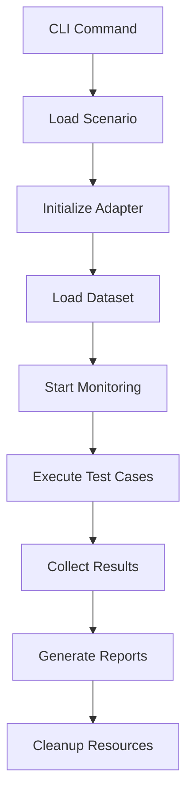
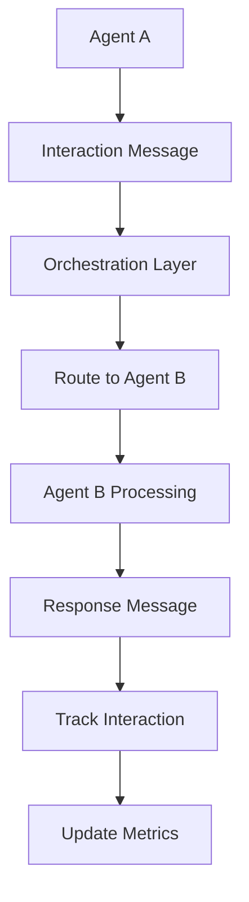
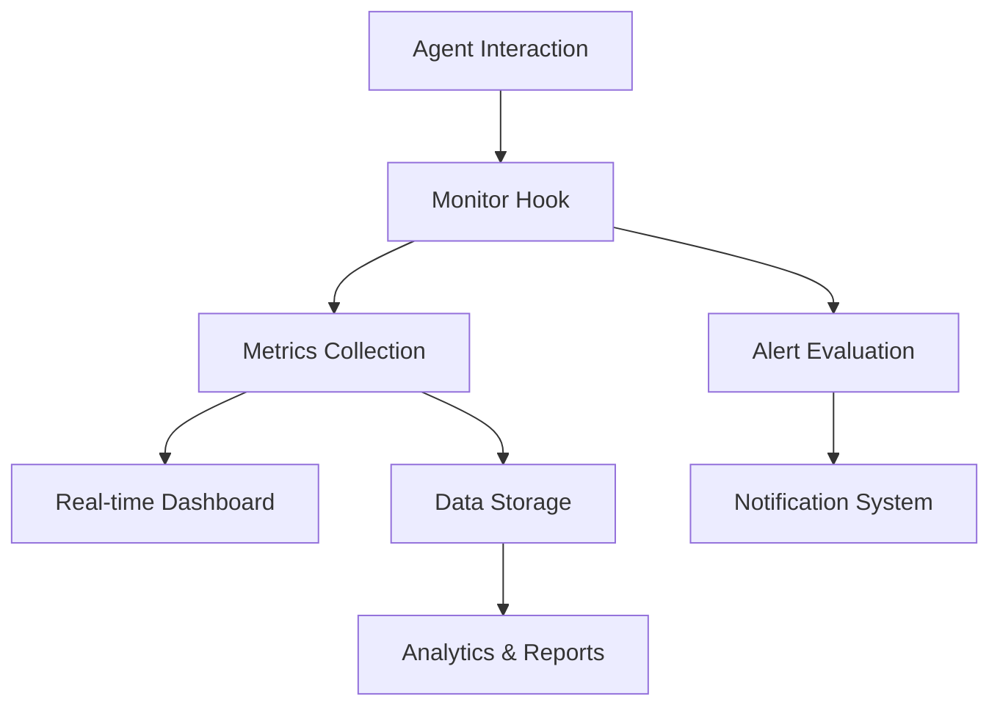

# AgentUnit Architecture Guide

## Overview

AgentUnit is designed as a modular, extensible framework for testing and monitoring multi-agent AI systems. The architecture follows clean separation of concerns with pluggable adapters, async processing, and production-ready monitoring capabilities.

## Core Architecture

```
┌─────────────────────────────────────────────────────────────┐
│                    AgentUnit Framework                      │
├─────────────────────────────────────────────────────────────┤
│ CLI Interface                                               │
│ ├── multiagent     ├── monitoring    ├── config           │
│ ├── analyze        └── help          └── templates        │
├─────────────────────────────────────────────────────────────┤
│ Core Framework                                              │
│ ├── Scenario       ├── Runner        ├── DatasetSource     │
│ ├── TraceLog       └── Exceptions    └── Results           │
├─────────────────────────────────────────────────────────────┤
│ Multi-Agent Orchestration                                   │
│ ├── MultiAgentAdapter    ├── AgentRole                     │
│ ├── SessionManager       ├── InteractionPattern           │
│ └── CommunicationModes   └── OrchestrationPattern          │
├─────────────────────────────────────────────────────────────┤
│ Platform Adapters                                          │
│ ├── AutoGen AG2    ├── OpenAI Swarm  ├── LangSmith        │
│ ├── AgentOps       └── Wandb         └── BaseAdapter      │
├─────────────────────────────────────────────────────────────┤
│ Monitoring & Production                                     │
│ ├── ProductionMonitor    ├── MetricsCollector             │
│ ├── AlertManager         └── PerformanceAnalytics         │
├─────────────────────────────────────────────────────────────┤
│ Reporting & Analytics                                       │
│ ├── ScenarioResult      ├── Exporters (JSON/XML/HTML)     │
│ ├── PerformanceMetrics  └── ComplianceReports             │
└─────────────────────────────────────────────────────────────┘
```

## Component Details

### 1. Core Framework (`src/agentunit/core/`)

The foundation of AgentUnit providing essential abstractions and execution logic.

#### Key Components:
- **Scenario**: Defines a reproducible test scenario with adapter, dataset, and configuration
- **Runner**: Executes scenarios and manages test execution lifecycle
- **DatasetSource**: Provides test cases and manages data loading
- **TraceLog**: Captures detailed execution traces for debugging and analysis
- **Exceptions**: Custom exception hierarchy for error handling

#### Design Patterns:
- **Factory Pattern**: For creating scenarios and adapters
- **Strategy Pattern**: For different execution strategies
- **Observer Pattern**: For monitoring execution progress

### 2. Multi-Agent Orchestration (`src/agentunit/multiagent/`)

Handles complex multi-agent interactions and coordination patterns.

#### Core Classes:
```python
@dataclass
class AgentRole:
    name: str
    description: str
    responsibilities: List[str]
    capabilities: List[str]

@dataclass  
class AgentInteraction:
    source_agent: AgentID
    target_agent: AgentID
    interaction_type: InteractionType
    content: str
    timestamp: datetime
    metadata: Dict[str, Any]

class MultiAgentAdapter(ABC):
    # Abstract base for all multi-agent platform integrations
    @abstractmethod
    async def run_scenario(self, scenario: Scenario) -> ScenarioResult
    
    @abstractmethod
    def get_agent_roles(self) -> Dict[AgentID, AgentRole]
    
    @abstractmethod
    def get_communication_modes(self) -> List[CommunicationMode]
```

#### Orchestration Patterns:
- **Sequential**: Agents interact in predefined order
- **Parallel**: Multiple agents work simultaneously
- **Hierarchical**: Structured command-and-control relationships
- **Peer-to-Peer**: Direct agent-to-agent communication
- **Hub-and-Spoke**: Central coordinator manages all interactions

### 3. Platform Adapters (`src/agentunit/adapters/`)

Platform-specific integrations that bridge AgentUnit with external frameworks.

#### Adapter Hierarchy:
```python
BaseAdapter (ABC)
├── MultiAgentAdapter (ABC)
│   ├── AG2Adapter           # AutoGen AG2 integration
│   ├── SwarmAdapter         # OpenAI Swarm integration
│   ├── LangSmithAdapter     # LangSmith monitoring
│   ├── AgentOpsAdapter      # AgentOps production monitoring  
│   └── WandbAdapter         # Wandb experiment tracking
└── SingleAgentAdapter (ABC)
    ├── LangGraphAdapter     # LangGraph workflows
    ├── CrewAIAdapter        # CrewAI agent teams
    └── CustomAdapter        # User-defined adapters
```

#### Adapter Contract:
```python
class BaseAdapter(ABC):
    @abstractmethod
    def prepare(self) -> None:
        """Perform lazy setup (loading models, connecting to services)"""
    
    @abstractmethod  
    def execute(self, case: DatasetCase, trace: TraceLog) -> AdapterOutcome:
        """Execute a single test case and return results"""
    
    def cleanup(self) -> None:
        """Clean up resources"""
        
    def supports_replay(self) -> bool:
        """Whether adapter supports replay functionality"""
```

### 4. Production Monitoring (`src/agentunit/monitoring/`)

Real-time monitoring and observability for production deployments.

#### Monitoring Architecture:
```python
class ProductionMonitor:
    def __init__(self, integrations: List[ProductionIntegration]):
        self.integrations = integrations
        self.metrics_collector = MetricsCollector()
        self.alert_manager = AlertManager()
    
    async def start_monitoring(self) -> None:
        """Start monitoring all configured integrations"""
    
    async def create_session(self, session_name: str) -> SessionID:
        """Create a new monitoring session"""
    
    async def track_interaction(self, interaction: AgentInteraction) -> None:
        """Track a single agent interaction"""
```

#### Production Integrations:
- **LangSmith**: Project monitoring, trace collection, evaluation
- **AgentOps**: Real-time observability, performance analytics
- **Wandb**: Experiment tracking, model comparison, collaboration

### 5. Reporting & Analytics (`src/agentunit/reporting/`)

Comprehensive reporting and analytics capabilities.

#### Report Types:
```python
@dataclass
class ScenarioResult:
    name: str
    runs: List[ScenarioRun]
    
    @property
    def success_rate(self) -> float:
        """Calculate overall success rate"""
    
    def aggregate_metric(self, name: str) -> float:
        """Aggregate a specific metric across all runs"""

@dataclass
class ScenarioRun:
    scenario_name: str
    case_id: str
    success: bool
    metrics: Dict[str, float]
    duration_ms: float
    trace: TraceLog
    error: Optional[str] = None
```

#### Export Formats:
- **JSON**: Machine-readable results for CI/CD integration
- **XML**: JUnit-compatible format for test runners
- **HTML**: Rich, interactive reports with charts and graphs
- **Markdown**: Human-readable summaries for documentation

### 6. CLI Interface (`src/agentunit/cli/`)

Command-line interface providing easy access to all framework capabilities.

#### Command Structure:
```bash
agentunit
├── multiagent
│   ├── run          # Execute multi-agent scenarios
│   ├── validate     # Validate scenario configurations
│   └── template     # Generate scenario templates
├── monitoring  
│   ├── start        # Start production monitoring
│   ├── stop         # Stop monitoring
│   ├── status       # Check monitoring status
│   └── report       # Generate monitoring reports
├── analyze
│   ├── results      # Analyze test results
│   ├── performance  # Performance analysis
│   └── compare      # Compare multiple runs
└── config
    ├── set          # Set configuration values
    ├── get          # Get configuration values
    └── reset        # Reset to defaults
```

## Data Flow

### 1. Test Execution Flow


### 2. Multi-Agent Interaction Flow


### 3. Production Monitoring Flow


## Extensibility Points

### 1. Custom Adapters
Create new platform integrations by extending `BaseAdapter` or `MultiAgentAdapter`:

```python
class CustomAdapter(MultiAgentAdapter):
    def __init__(self, config: Dict[str, Any]):
        super().__init__(config)
        # Initialize your platform connection
    
    async def run_scenario(self, scenario: Scenario) -> ScenarioResult:
        # Implement scenario execution logic
        pass
    
    def get_agent_roles(self) -> Dict[AgentID, AgentRole]:
        # Return available agent roles
        pass
```

### 2. Custom Metrics
Add new metrics by implementing the metrics interface:

```python
class CustomMetric:
    def __init__(self, name: str):
        self.name = name
    
    def calculate(self, expected: str, actual: str) -> float:
        # Implement metric calculation
        pass
```

### 3. Custom Exporters
Create new report formats by extending the exporter base:

```python
class CustomExporter:
    def export(self, results: ScenarioResult, path: Path) -> None:
        # Implement custom export logic
        pass
```

## Performance Considerations

### 1. Async Architecture
- All I/O operations are asynchronous
- Concurrent execution of multiple scenarios
- Non-blocking monitoring and reporting

### 2. Memory Management
- Lazy loading of datasets and models
- Streaming processing for large datasets
- Configurable memory limits and cleanup

### 3. Scalability
- Horizontal scaling through multiple workers
- Load balancing across available resources
- Efficient resource pooling and reuse

## Security & Privacy

### 1. Credential Management
- Secure storage of API keys and credentials
- Support for environment variables and key management systems
- Automatic credential rotation capabilities

### 2. Data Privacy
- No sensitive data logged by default
- Configurable data masking and filtering
- GDPR and compliance-ready data handling

### 3. Audit Trail
- Complete audit log of all operations
- Tamper-proof logging with checksums
- Integration with enterprise audit systems

## Configuration Management

### 1. Configuration Hierarchy
```yaml
# Global defaults
defaults:
  timeout: 60
  retries: 3
  
# Platform-specific settings  
adapters:
  autogen_ag2:
    model: "gpt-4"
    max_turns: 10
  langsmith:
    project: "production"
    
# Monitoring configuration
monitoring:
  enabled: true
  real_time: true
  alerts:
    error_threshold: 0.05
```

### 2. Environment Support
- Development, staging, production configurations
- Environment-specific overrides
- Validation and schema checking

This architecture ensures AgentUnit remains flexible, maintainable, and production-ready while providing comprehensive testing and monitoring capabilities for multi-agent AI systems.